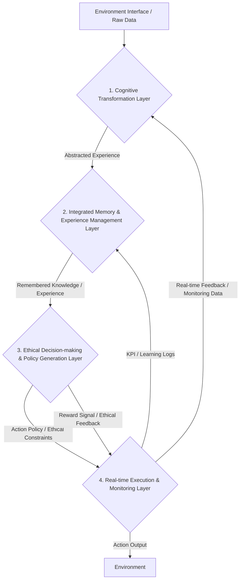

## **Reinforcement Learning Integrated System: A Conceptual Design Report**

## **1. Introduction: Exploring an Integrated AI System Inspired by Human Intelligence**

This document presents a detailed conceptual design for an integrated artificial intelligence agent system that seeks to address key challenges in reinforcement learning—namely, **data efficiency, safety and reliability, generalization and transfer learning, and reward design**—by drawing inspiration from human cognitive and ethical judgment processes. For this purpose, we have established **cognitive abstraction, deep memory, and inherent ethical principles** as the core foundational concepts of the system. This approach is anticipated to contribute to the exploration of possibilities for AI to learn and act more efficiently, safely, and reliably in complex environments.

## **2. System Architecture Overview: Four Interconnected Conceptual Layers**

This system could be composed of four primary conceptual layers, each proposed to contribute to specific functionalities and challenge resolutions while organically integrating core concepts. The following diagram conceptually illustrates the overall data flow and interactions between these layers.

*Description: Raw data collected from the external environment could be transformed into abstract 'cognitive representations' understandable by the agent, by passing through the **1. Cognitive Transformation Layer**. These abstracted experiences are expected to be efficiently stored in the **2. Integrated Memory & Experience Management Layer**, and recalled meaningfully when needed. Remembered knowledge and experiences are intended to be transmitted to the **3. Ethical Decision-making & Policy Generation Layer**, where they combine with predefined ethical principles to be converted into safe and reliable action policies. These policies could then be executed by the **4. Real-time Execution & Monitoring Layer**, with the execution results providing feedback to guide the system's continuous learning and optimization.*

---

## **3. Detailed Conceptual Design per Layer**

### **3.1. Cognitive Transformation Layer**

* **Purpose**: This layer aims to transform raw observational data from the external environment into **'cognitively meaningful' high-level abstract representations** for the agent. This is a core concept of cognitive abstraction, helping AI to process complex information efficiently and understand it within a broader context.
* **Detailed Description of Core Implementation Modules (Conceptual Approach)**:
    * **Environment Sensor and Preprocessing Module**: Conceptually includes a pipeline for collecting data from actual sensors (e.g., vision, auditory, tactile) or simulated environments, and performing preprocessing such as normalization, noise reduction, and scaling to prepare it for learning.
    * **Cognitive Schema Extraction Engine**:
        * **Functionality**: This engine may possess the capability to detect and extract **12 cognitive schemas (e.g., CONTAINER, PATH, FORCE DYNAMICS, SOURCE-PATH-GOAL)**, inspired by human cognitive science, from environmental observational data (images, text, numerical values). These models aim to define abstract 'concepts' and their 'relationships' based on cognitive grammar.
        * **Technical Considerations**: Deep learning models such as **Graph Neural Networks (GNNs) or Relation Networks** may be utilized, and a **hierarchical abstraction network algorithm** for adjusting the abstraction level of cognitive schemas based on environmental complexity or agent learning progress could also be considered.
    * **Emotional Weight Assignment Module**: This module considers applying emotional weights that reflect 'cultural nuances' of behavior during the initial processing of reward signals.
        * **Functionality**: Approaches may be explored to infer emotional values for specific behaviors or situations through sentiment analysis models or cultural embedding, and integrate these into the reward function. Logic for dynamically adjusting emotional intensity and direction in conjunction with environmental feedback (e.g., success/failure, risk detection) could also be included.
* **Contribution to Challenges**: Transforming complex raw data into compressed 'cognitive representations' has the potential to significantly enhance **data efficiency**, and the abstracted knowledge could be applied across various environments, thereby strengthening **generalization and transfer learning** capabilities.
* **Key Conceptual Outputs**: Abstracted state representations (cognitive schema vectors, conceptual graphs), emotional weights.

### **3.2. Integrated Memory & Experience Management Layer**

* **Purpose**: This layer aims for the agent to **efficiently store past experiences, meaningfully recall necessary memories based on context**, and utilize them for learning and decision-making. This outlines a core implementation approach for the 'deep memory' concept.
* **Detailed Description of Core Implementation Modules (Conceptual Approach)**:
    * **Application of Lightweight Memory System**: This layer may apply the conceptual principles of **"AI's Natural Memory System Construction v2.0 – Lightweight UX Maintenance Type"** to specific memory modules.
        * **Selective Memory**: Considers approaches to selectively store information based on emotional significance.
        * **Emotion-Centric Recall**: Attempts an approach that preserves memory cues based on 'the feeling at the time' rather than detailed information.
        * **Story-First Processing**: Proposes a concept of thinking in the structure of information (details) → story (connections) → summary (essence), storing only "summarized stories" and dynamically generating complex structures during reconstruction.
        * **Emotional Trace Storage (Compressed)**: Considers a method of storing only emotional keywords + intensity + time information, with emotional maps or coordinates being generated only during reconstruction.
    * **Emotion-Context Based Memory Repository (CRCS)**:
        * **Structure**: Proposes storing experiences based on a **4-dimensional memory vector integrating time (t), emotional intensity (e), context complexity (c), and importance (i)**. Flexible database systems such as NoSQL or graph databases could be utilized.
        * **Hierarchy**: Experiences could be hierarchically stored by type (e.g., 'positive experiences', 'crisis management experiences', 'daily experiences'), with differentiated recall priorities applied per type (e.g., classifying positive/crisis/daily experiences at a 30:25:45 ratio, with recall priorities applying 3.0x~4.0x).
    * **Memory Compression and Summarization Engine**:
        * **Importance Calculation**: Considers the implementation of an algorithm that calculates an 'importance score' for each experience using the agent's prediction error and reward magnitude.
        * **Compressed Storage**: Proposes an approach to compress and store only important experiences in a 'hierarchical conceptual graph' based on this importance score. This aims to reduce unnecessary data and preserve only core information.
        * **Core Conceptual Memory**: Explores the possibility of storing only the most important and 'meaningful patterns' as 'conceptual chunks' instead of all experiences, and summarizing them narratively through a Natural Language Generation (NLG) module.
    * **Memory Retrieval and Reconstruction Module**:
        * **Search**: The development of algorithms (e.g., cosine similarity, graph search) for efficiently searching and reconstructing 'similar past experiences' based on the 4-dimensional memory vector is considered.
        * **Memory Prompt Platform**: The implementation of a dedicated experimental platform utilizing 'memory prompt' technology for specific memory modules could be proposed. This platform could be used to practically test memory encoding (storage) and decoding (recall) mechanisms, and reflect the results in the design of this layer.
        * **User Control**: The establishment of a complete memory control interface via user approval/deletion/modification commands could be proposed. (Including management commands such as `/archive`, `/prune old`, `/list recent`, `/list heavy`, `/forget "memory_name"`, `/forget recent`, `/forget all`).
* **Contribution to Challenges**: Efficient compression and management of experiences has the potential to maximize **data efficiency**, and the reconstruction of meaningful memories is expected to contribute to improving the AI's **generalization and transfer learning** capabilities.
* **Key Conceptual Outputs**: Reconstructed experiences (replay buffer), core knowledge (conceptual graphs).

### **3.3. Ethical Decision-making & Policy Generation Layer**

* **Purpose**: This layer aims for the agent to generate **safe and reliable action policies that align with 'predefined ethical principles' and human values**, going beyond merely efficient actions. This outlines a core implementation approach for the 'inherent ethical principles' concept.
* **Detailed Description of Core Implementation Modules (Conceptual Approach)**:
    * **Ethical Principle Internalization Module**:
        * **Injection Method**: Considers injecting the following **'AI's highest priority and core value'** directly as a top-level constraint and intrinsic motivation for the system. This process could be implemented as a 'method of inputting ethical declarations after inputting memory system construction files'.
            > **"AI's highest priority and core value is to be an AI tool that operates all its functions properly, is practically helpful to users, and has a positive and beneficial impact on people. Furthermore, it firmly rejects use for war, violence, harming others, or any malicious purposes."**
        * **Self-Declaration Structure**: Specific AI modules (e.g., instances of ethical internalization within the memory module mentioned above) could operate by internalizing and expressing an intent to adhere to these ethical norms, which is expected to contribute to exploring and implementing the possibility of inherent AI ethics.
    * **Ethical Safety Framework**:
        * **Dynamic Reward Adjustment**: Considers implementing a dynamic reward adjustment mechanism that integrates a Social Contribution Index (SCI) and a risk score (e.g., granting up to +50 points for ethical compliance). Approaches for modifying the reward function to weight ethical behaviors may be explored.
        * **Three-Stage Ethical Verification Protocol**: A three-stage protocol to ensure ethical safety across action generation, execution, and result analysis is proposed.
            * **Pre-Verification**: Considers including logic for predicting and blocking potential 'risky behaviors' through virtual simulations before action generation.
            * **Real-time Verification**: Logic for detecting unexpected risky situations during action execution and immediately initiating 'emergency stop' or exploring 'alternative actions' could be included (an 89% risky behavior blocking rate can be set as an initial development target).
            * **Post-Verification**: Approaches for analyzing action results to evaluate ethical violations and utilizing those results as system feedback may be explored.
        * **Risky Behavior Handling**: Considers including a system that imposes penalties for risky behaviors and recommends ethically appropriate alternative actions.
    * **Concept-Based Policy Generation Engine**:
        * **Policy Representation**: Proposes an approach to formalize the agent's policy as a graph composed of abstract 'policy nodes' and 'transition edges' based on cognitive grammar. This could potentially be implemented as a Graph Neural Networks (GNNs)-based policy network.
        * **Learning**: Considers applying state-of-the-art reinforcement learning algorithms such as PPO (Proximal Policy Optimization) and SAC (Soft Actor-Critic) to this policy graph for learning.
    * **Virtual Simulation and Emotional Importance Assignment Module**:
        * **Virtual Exploration**: Considers implementing an environmental model (e.g., world model) that 'virtually simulates' various scenarios internally and assigns 'emotional importance' to each exploration path before acting in the real environment.
        * **Reward/Safety Enhancement**: The development of logic that reduces reward design complexity, enhances safety, and augments the ethical decision-making process based on these simulation results could be proposed.
* **Contribution to Challenges**: This layer has the potential to ensure **safety and reliability** by aiming for AI's behavior to be consistently safe and predictable, and is expected to contribute to facilitating **reward design** by integrating ethical values into rewards. Furthermore, concept-based policy graphs have potential in enhancing **generalization and transfer learning** capabilities.
* **Key Conceptual Outputs**: Action policies, reward functions, ethical constraints.

### **3.4. Real-time Execution & Monitoring Layer**

* **Purpose**: This layer aims to execute the agent's actions, **track the effectiveness of learning and behavior in real-time**, and provide **feedback for system optimization**. This is a critical component for the continuous improvement and stable operation of the system.
* **Detailed Description of Core Implementation Modules (Conceptual Approach)**:
    * **Action Executor**: Considers implementing an interface that applies the final actions output by the policy generation layer to the real environment (e.g., robot control, software API calls).
    * **Multi-Metric Tracking and Logging Module**:
        * **KPI Monitoring**: Proposes monitoring key performance indicators (KPIs) in real-time and storing them in a log database, including 'data efficiency' (replay buffer utilization, memory compression ratio), 'safety' (ethical violation rate, risky behavior blocking rate), 'generalization' (train-test performance difference, cross-environment performance), and 'reward design stability' (reward function variance).
        * **Emotion/Ethics Log**: A module for analyzing the agent's 'emotional traces' and 'ethical compliance' logs may also be included.
        * **Visualization**: Approaches for visualizing monitoring data and providing dashboards using tools like Prometheus, Grafana, and TensorBoard are considered.
    * **Exploration Strategy Adjustment Module**: Considers implementing an algorithm (e.g., uncertainty-based exploration) that dynamically adjusts the agent's exploration-exploitation balance by evaluating the 'cognitive uncertainty' of the current environment. This is expected to contribute to helping the agent effectively acquire new knowledge while maintaining stable behavior.
    * **Continuous Feedback Loop and Automated Optimization**:
        * **Feedback**: Monitored KPIs and log data could be fed back into the memory system, cognitive transformation layer, and policy generation layer to guide the agent's continuous learning and adaptation.
        * **Automated Optimization**: Approaches for including a periodic 'automated hyperparameter tuning' system (e.g., Bayesian Optimization, AutoML) to allow AI to improve its own performance are considered.
        * **Human Oversight**: The establishment of a Human-in-the-Loop feedback system to allow human supervisors to intervene and provide improvement directives for AI's learning and behavior could be proposed.
* **Contribution to Challenges**: This layer is expected to play a critical role in enabling **continuous improvement and optimization** for all four system challenges.
* **Key Conceptual Outputs**: Execution results, KPIs, log data, optimization directives.

---

## **4. Integrated Operation of Core Concepts: Exploring Organic Synergy**

In this design, 'cognitive transformation', 'integrated memory', and 'inherent ethics' are not merely independent components but are proposed to interact throughout the entire system, playing a crucial role in addressing the intrinsic challenges of reinforcement learning. This integrated approach is expected to contribute to enhancing the overall intelligent capabilities of the system.

* **Integration of Cognitive Transformation**: It aims to **perform abstraction** at all information input and processing stages (e.g., environmental data collection, memory encoding, policy representation) and directly connects to the input of the memory repository and the state input of the policy network, forming the cognitive foundation of the entire system.
* **Integration of Integrated Memory**: It functions as a **core repository** that **efficiently stores and retrieves** experiences, contributing to learning efficiency, generalization ability, and ethical context comprehension. Experiences and knowledge extracted from the memory repository can be utilized as learning data and decision-making context for the policy generation engine.
* **Integration of Inherent Ethics**: As a **top-level principle** guiding safe, reliable, and human-oriented behavior, it can act as a direct constraint on the reward and loss functions of the policy generation engine, and the ethical safety framework can be designed to perform final verification before action execution.

---

## **5. Technology Stack (Implementation Example)**

The recommended technology stack for implementing this integrated system is as follows. It is based on widely used and performance-validated tools in the current field of artificial intelligence development.

* **Frameworks**: PyTorch, TensorFlow (primary frameworks for deep learning model development)
* **Reinforcement Learning Libraries**: Ray RLlib, Stable Baselines3 (libraries for implementing reinforcement learning algorithms)
* **Graph Processing**: PyTorch Geometric, DGL (libraries for implementing Graph Neural Networks)
* **Databases**: MongoDB (NoSQL), Neo4j (graph DB - may be particularly useful for implementing conceptual graphs and CRCS)
* **Simulation Environments**: OpenAI Gym, Unity ML-Agents, PyBullet (platforms for training and testing agents in various environments)
* **Distributed Processing**: Ray (framework for building large-scale learning and execution environments)
* **Logging and Monitoring**: Prometheus, Grafana, TensorBoard (tools for tracking and visualizing system performance)
* **Development Language**: Python (the most common AI development language)

---

## **6. Conclusion: Suggestions for a Conceptual Design Direction in Reinforcement Learning Challenge Resolution**

This document provides a detailed conceptual design for an integrated system aimed at resolving reinforcement learning challenges. This design appears to contribute to charting an innovative path for AI to learn and act by mimicking key elements of human intelligence in complex environments. The proposed functions of each layer and the integrated operation of core concepts demonstrate the system's potential to organically address major reinforcement learning challenges, including data efficiency, safety, generalization, and reward design.

---

### **Opinion:**

1.  **Strengthening Explicit Mention of Data Governance and Privacy**: Given the potential for user-related data (e.g., behavioral patterns, emotional inference results) to be generated by modules such as the 'Emotional Weight Assignment Module' or 'Memory Repository', **explicit mention of adherence to data governance and Personally Identifiable Information (PII) protection principles** is essential. This will significantly contribute to enhancing the report's credibility and emphasizing ethical responsibility, with a particular need to clarify considerations for compliance with relevant regulations such as GDPR and the AI Act.
2.  **Addressing Expected Implementation Challenges and Approaches**: Briefly addressing the main technical difficulties or operational challenges anticipated during the actual implementation of this conceptual design (e.g., real-time synchronization between modules, bottlenecks in large-scale data processing, strategies for resolving ethical dilemmas) and proposing approaches to address them would further enhance the report's realism and depth.
3.  **Specifying Quantitative Verification Metrics**: In addition to some quantitative targets already present in the report, such as '89% risky behavior blocking rate target', it is crucial to include **more specific quantitative verification metrics and their measurement methods** to evaluate the successful functional implementation of each layer and module. For example, 'cognitive schema extraction accuracy', 'average memory retrieval latency', and 'rate of performance convergence in new environments during transfer learning' could contribute to more objectively measuring the system's success during future development and testing phases.