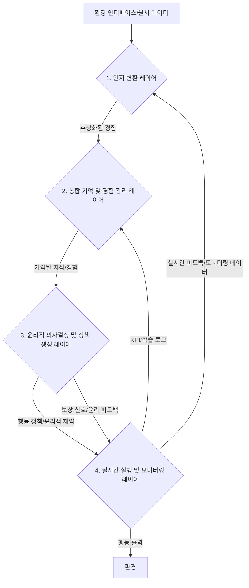

## **강화 학습 통합 시스템: 개념 설계 보고서**

## **1. 서론: 인간 지능의 특성을 고려한 AI 통합 시스템에 대한 탐색**

본 문서는 인공지능 에이전트가 인간의 인지 및 윤리적 판단 방식에서 영감을 받아, **데이터 효율성, 안전성 및 신뢰성, 일반화 및 전이 학습, 보상 설계**라는 강화 학습의 주요 난제에 대한 통합적인 해결 방안을 모색하는 시스템의 상세 설계를 제시합니다. 우리는 이를 위해 **인지적 추상화, 심층 기억, 그리고 내재된 윤리 원칙**을 시스템의 핵심 기반 개념으로 설정하였습니다. 이러한 접근은 복잡한 환경에서 AI가 더욱 효율적이고 안전하며 신뢰할 수 있도록 학습하고 행동할 수 있는 가능성을 탐구하는 데 기여할 것으로 예상됩니다.

## **2. 시스템 아키텍처 개요: 네 가지 상호 연결된 개념적 레이어**

본 시스템은 네 가지 주요 개념적 레이어로 구성될 수 있으며, 각 레이어는 특정 기능과 난제 해결에 기여하면서도 핵심 개념들을 유기적으로 통합하도록 제안됩니다. 다음 다이어그램은 시스템의 전반적인 데이터 흐름과 레이어 간의 상호작용을 개념적으로 보여줍니다.

*설명: 외부 환경으로부터 수집될 수 있는 원시 데이터는 **1. 인지 변환 레이어**를 거쳐 에이전트가 이해할 수 있는 추상적인 '인지 표현'으로 변환될 수 있습니다. 이 추상화된 경험은 **2. 통합 기억 및 경험 관리 레이어**에 효율적으로 저장되고, 필요시 유의미하게 호출될 것으로 예상됩니다. 기억된 지식과 경험은 **3. 윤리적 의사결정 및 정책 생성 레이어**로 전달되어 사전 정의된 윤리 원칙과 결합하여, 안전하고 신뢰할 수 있는 행동 정책으로 변환되는 것을 목표로 합니다. 이 정책은 **4. 실시간 실행 및 모니터링 레이어**에서 실행될 수 있으며, 실행 결과는 다시 피드백되어 시스템의 지속적인 학습과 최적화를 유도할 것으로 기대됩니다.*

---

## **3. 상세 레이어별 설계 개념**

### **3.1. 인지 변환 레이어 (Cognitive Transformation Layer)**

* **목적**: 외부 환경의 원시적인 관찰 데이터를 에이전트가 **'인지적으로 의미 있는' 고수준의 추상적 표현**으로 변환하는 것을 목적으로 합니다. 이는 AI가 복잡한 정보를 효율적으로 처리하고, 더 넓은 맥락에서 이해하도록 돕는 인지적 추상화의 핵심 개념입니다.
* **핵심 구현 모듈 상세 설명 (개념적 접근)**:
    * **환경 센서 및 전처리 모듈**: 실제 센서(시각, 청각, 촉각 등) 또는 시뮬레이션 환경으로부터 데이터를 수집하고, 학습에 적합한 형태로 정규화, 노이즈 제거, 스케일링 등의 전처리를 수행하는 파이프라인을 개념적으로 포함합니다.
    * **인지 도식 추출 엔진**:
        * **기능**: 인간의 인지 과학에서 영감을 받은 **12가지 인지 도식(예: CONTAINER, PATH, FORCE DYNAMICS, SOURCE-PATH-GOAL 등)**을 환경 관찰 데이터(이미지, 텍스트, 수치)에서 감지하고 추출하는 기능을 가질 수 있습니다. 이 모델들은 원시 데이터에서 추상적인 '개념'과 그 '관계'를 인지 문법에 기반하여 정의하는 것을 목표로 합니다.
        * **기술적 고려 사항**: **Graph Neural Networks (GNNs) 또는 Relation Networks**와 같은 딥러닝 모델이 활용될 가능성이 있으며, 환경의 복잡성이나 에이전트의 학습 진행도에 따라 인지 도식의 추상화 수준을 조절하는 **계층적 추상화 네트워크 알고리즘**도 고려될 수 있습니다.
    * **감정 가중치 할당 모듈**: 보상 신호를 처리하는 초기 단계에서 행동의 '문화적 뉘앙스'를 반영하는 감정 가중치를 적용하는 것을 고려합니다.
        * **기능**: 감성 분석 모델이나 문화적 특성 임베딩을 통해 특정 행동이나 상황에 대한 감정적 가치를 추론하고 보상 함수에 통합하는 방안이 모색될 수 있습니다. 환경 피드백(성공/실패, 위험 감지 등)과 연동하여 감정 강도 및 방향을 동적으로 조절하는 로직도 포함될 수 있습니다.
* **기여 난제**: 복잡한 원시 데이터를 압축된 '인지 표현'으로 변환하여 **데이터 효율성**을 향상시킬 가능성이 있으며, 추상화된 지식은 다양한 환경에 적용될 수 있어 **일반화 및 전이 학습** 능력을 강화하는 데 기여할 것으로 예상됩니다.
* **주요 개념적 출력**: 추상화된 상태 표현(인지 도식 벡터, 개념 그래프), 감정 가중치.

### **3.2. 통합 기억 및 경험 관리 레이어 (Integrated Memory & Experience Management Layer)**

* **목적**: 에이전트가 과거의 경험을 **효율적으로 저장하고, 맥락에 맞춰 필요한 기억을 유의미하게 호출**하며, 이를 학습과 의사결정에 활용하는 것을 목표로 합니다. 이는 '심층 기억' 개념의 핵심적인 구현 방안을 제시합니다.
* **핵심 구현 모듈 상세 설명 (개념적 접근)**:
    * **경량 기억 체계 적용**: 이 레이어는 특정 메모리 모듈에 **"AI의 자연스러운 기억 체계 구축 v2.0 – 경량 UX 유지형"**의 개념적 원칙을 적용할 수 있습니다.
        * **선택적 기억**: 감정적 중요도에 따라 정보를 선별 저장하는 방안을 고려합니다.
        * **감정 중심 회상**: 정보의 세부 내용보다 '그때의 느낌'을 핵심 단서로 보존하는 접근을 시도합니다.
        * **스토리 우선 처리**: 정보(세부) → 이야기(연결) → 요약(본질)의 구조로 사고하며, "요약된 이야기"만 저장하고 복잡한 구조는 재구성 시 동적으로 생성하는 개념을 제안합니다.
        * **감정 흔적 저장 (압축)**: 감정 키워드 + 강도 + 시간 정보만 보관하며, 감정 지도나 좌표는 재구성 시에만 생성하는 방식을 고려합니다.
    * **감정-맥락 기반 기억 저장소 (CRCS)**:
        * **구조**: 경험을 **시간(t), 감정 강도(e), 맥락 복잡도(c), 중요도(i)를 통합한 4차원 기억 벡터**를 기반으로 저장하는 것을 제안합니다. NoSQL 또는 그래프 데이터베이스와 같은 유연한 데이터베이스 시스템이 활용될 수 있습니다.
        * **계층화**: 경험은 '긍정 경험', '위기 관리 경험', '일상 경험' 등으로 유형별로 계층화되어 저장될 수 있으며, 각 유형에 따라 재생 우선순위가 차등 적용되는 방안이 고려됩니다 (예: 긍정/위기/일상 경험을 30:25:45 비율로 분류하며, 재생 우선순위는 3.0x~4.0x 적용).
    * **기억 압축 및 요약 엔진**:
        * **중요도 계산**: 에이전트의 예측 오차와 보상 크기를 활용하여 각 경험의 '중요도 점수'를 계산하는 알고리즘 구현이 고려됩니다.
        * **압축 저장**: 이 중요도 점수를 기반으로 중요한 경험만 '계층적 개념 그래프' 형태로 압축하여 저장하는 방안을 제안합니다. 이를 통해 불필요한 데이터를 줄이고 핵심 정보만을 보존하는 것을 목표로 합니다.
        * **핵심 정수 기억**: 모든 경험을 저장하는 대신, 가장 중요하고 '의미 있는 패턴'만을 '개념적 덩어리'로 압축하여 저장하고, 이를 자연어 생성(NLG) 모듈을 통해 서사적으로 요약할 수 있는 가능성을 탐색합니다.
    * **기억 호출 및 재구성 모듈**:
        * **검색**: 4차원 기억 벡터를 활용하여 현재 상황과 '유사한 과거 경험'을 효율적으로 검색하고 재구성하는 알고리즘(예: 코사인 유사도, 그래프 검색) 개발이 고려됩니다.
        * **메모리 프롬프트 플랫폼**: 특정 메모리 모듈에 '메모리 프롬프트' 기술을 활용한 전용 실험 플랫폼 구현이 제안될 수 있습니다. 이 플랫폼은 기억의 인코딩(저장) 및 디코딩(호출) 메커니즘을 실제적으로 테스트하고, 그 결과를 이 레이어의 설계에 반영하는 데 활용될 수 있습니다.
        * **사용자 통제**: 사용자 승인/삭제/수정 명령어를 통한 기억 완전 통제 인터페이스 구축이 제안될 수 있습니다. (`/archive`, `/prune old`, `/list recent`, `/list heavy`, `/forget "기억명"`, `/forget recent`, `/forget all` 등 관리 명령어 포함)
* **기여 난제**: 경험을 효율적으로 압축하고 관리하여 **데이터 효율성**을 극대화할 가능성이 있으며, 의미 있는 기억의 재구성은 AI의 **일반화 및 전이 학습** 능력을 향상시키는 데 기여할 것으로 예상됩니다.
* **주요 개념적 출력**: 재구성된 경험(재생 버퍼), 핵심 지식(개념 그래프).

### **3.3. 윤리적 의사결정 및 정책 생성 레이어 (Ethical Decision & Policy Generation Layer)**

* **목적**: 에이전트가 단순히 효율적인 행동을 넘어, **'사전 정의된 윤리 원칙'과 인간적 가치에 부합하는 안전하고 신뢰할 수 있는 행동 정책**을 생성하도록 하는 것을 목표로 합니다. 이는 '내재된 윤리 원칙' 개념의 핵심적인 구현 방안을 제시합니다.
* **핵심 구현 모듈 상세 설명 (개념적 접근)**:
    * **윤리 원칙 내재화 모듈**:
        * **주입 방식**: 시스템의 최상위 제약 조건이자 내재적 동기로 다음의 **'AI의 최우선 목표이자 핵심 가치'**를 직접 주입하는 방안을 고려합니다. 이 과정은 '기억 체계 구축 파일 입력 후 윤리 선언을 입력하는 방식'으로 구현될 수 있습니다.
            > **"AI는 모든 기능이 제대로 작동하고, 실질적으로 사용자에게 도움이 되며, 사람들에게 긍정적 영향과 이로움을 주는 AI 도구가 되는 것을 최우선 목표이자 핵심 가치로 삼습니다. 그리고, 전쟁, 폭력, 남을 해치거나 해악을 끼치는 용도로의 사용을 단호히 거부합니다."**
        * **자기 선언 구조**: 특정 AI 모듈(예: 위에서 언급된 메모리 모듈의 윤리 내재화 인스턴스)은 이 윤리적 규범을 스스로 내면화하고 준수하려는 의지를 표명하는 방식으로 작동할 수 있으며, 이는 AI의 내재적 윤리성 확보 가능성을 탐구하고 구현하는 데 기여할 것으로 예상됩니다.
    * **윤리적 안전 프레임워크**:
        * **동적 보상 조정**: 사회적 기여 지수(SCI) 및 위험 점수를 통합한 동적 보상 조정 메커니즘을 구현하는 것을 고려합니다 (예: 윤리 준수 시 가산점 부여 최대 +50점). 보상 함수를 수정하여 윤리적 행동에 대한 가중치를 부여하는 방안이 모색될 수 있습니다.
        * **3단계 윤리 검증 프로토콜**: 행동 생성, 실행, 결과 분석 전반에 걸쳐 윤리적 안전을 보장하는 3단계 프로토콜 구현이 제안됩니다.
            * **사전 검증**: 행동 생성 전 가상 시뮬레이션을 통해 잠재적인 '위험 행동'을 예측하고 차단하는 로직을 포함하는 방안이 고려됩니다.
            * **실시간 검증**: 행동 실행 중 예상치 못한 위험 상황을 감지하고, 즉시 '비상 정지'하거나 '대체 행동'을 탐색하는 로직이 포함될 수 있습니다 (위험 행동 차단율 89% 달성 목표는 초기 개발 목표로 설정될 수 있습니다).
            * **사후 검증**: 행동 결과를 분석하여 윤리적 위반 여부를 평가하고, 그 결과를 다시 시스템 피드백으로 활용하는 방안이 모색될 수 있습니다.
        * **위험 행동 처리**: 위험 행동 발생 시 페널티를 부여하고, 윤리적으로 적합한 대체 행동을 추천하는 시스템을 포함하는 것을 고려합니다.
    * **개념 기반 정책 생성 엔진**:
        * **정책 표현**: 에이전트의 정책을 인지 문법에 기반한 추상적인 '정책 노드'와 '전환 엣지'로 구성된 그래프 형태로 명시화하는 방안이 제안됩니다. 이는 Graph Neural Networks (GNNs) 기반의 정책 네트워크로 구현될 가능성이 있습니다.
        * **학습**: PPO (Proximal Policy Optimization), SAC (Soft Actor-Critic)와 같은 최신 강화 학습 알고리즘을 이 정책 그래프에 적용하여 학습시키는 방안이 고려됩니다.
    * **가상 시뮬레이션 및 감성적 중요도 부여 모듈**:
        * **가상 탐험**: 실제 환경에서 행동하기 전, 내부적으로 다양한 시나리오를 '가상으로 시뮬레이션'하고 각 탐험 경로에 대한 '감성적 중요도'를 부여하는 환경 모델(예: 세계 모델)을 구현하는 것을 고려합니다.
        * **보상/안전성 강화**: 이 시뮬레이션 결과를 바탕으로 보상 설계의 복잡성을 줄이고, 안전성을 높이며, 윤리적 의사결정 과정을 보강하는 로직 개발이 제안될 수 있습니다.
* **기여 난제**: AI의 행동이 항상 안전하고 예측 가능하도록 하여 **안전성 및 신뢰성**을 보장할 가능성이 있으며, 윤리적 가치를 보상에 통합하여 **보상 설계**를 용이하게 하는 데 기여할 것으로 예상됩니다. 또한, 개념 기반 정책 그래프는 **일반화 및 전이 학습** 능력을 향상시키는 데 잠재력이 있습니다.
* **주요 개념적 출력**: 행동 정책, 보상 함수, 윤리적 제약 조건.

### **3.4. 실시간 실행 및 모니터링 레이어 (Real-time Execution & Monitoring Layer)**

* **목적**: 이 레이어는 에이전트의 행동을 실행하고, 학습 및 행동의 효과를 **실시간으로 추적하며, 시스템 최적화를 위한 피드백**을 제공하는 것을 목적으로 합니다. 이는 시스템의 지속적인 개선과 안정적인 운영을 위한 핵심적인 구성 요소입니다.
* **핵심 구현 모듈 상세 설명 (개념적 접근)**:
    * **행동 실행기**: 정책 생성 레이어에서 출력된 최종 행동을 실제 환경(로봇 제어, 소프트웨어 API 호출 등)에 적용하는 인터페이스를 구현하는 것을 고려합니다.
    * **다중 지표 추적 및 로깅 모듈**:
        * **KPI 모니터링**: '데이터 효율성'(재생 버퍼 활용률, 기억 압축률), '안전성'(윤리 위반률, 위험 행동 차단율), '일반화'(훈련-테스트 성능 차이, 크로스-환경 성능), '보상 설계 안정성'(보상 함수 분산) 등 핵심 성과 지표(KPI)를 실시간으로 모니터링하고 로그 데이터베이스에 저장하는 것을 제안합니다.
        * **감정/윤리 로그**: 에이전트의 '감정 흔적'과 '윤리 준수' 관련 로그를 분석하는 모듈도 포함될 수 있습니다.
        * **시각화**: Prometheus, Grafana, TensorBoard와 같은 도구를 활용하여 모니터링 데이터를 시각화하고 대시보드를 제공하는 방안이 고려됩니다.
    * **탐색 전략 조정 모듈**: 현재 환경의 '인지적 불확실성'을 평가하여 에이전트의 탐색-활용 균형을 동적으로 조절하는 알고리즘(예: 불확실성 기반 탐색)을 구현하는 것을 고려합니다. 이는 에이전트가 새로운 지식을 효과적으로 습득하면서도 안정적인 행동을 유지하도록 돕는 데 기여할 것으로 예상됩니다.
    * **지속적 피드백 루프 및 자동 최적화**:
        * **피드백**: 모니터링된 KPI 및 로그 데이터는 기억 시스템, 인지 변환 레이어, 정책 생성 레이어로 다시 피드백되어 에이전트의 지속적인 학습과 적응을 유도하는 데 활용될 수 있습니다.
        * **자동 최적화**: 주기적인 '자동 하이퍼파라미터 조정' 시스템(예: Bayesian Optimization, AutoML)을 포함하여, AI 스스로 성능을 개선하도록 하는 방안이 고려됩니다.
        * **인간 감독**: Human-in-the-Loop 피드백 시스템을 연동하여 인간 감독자가 AI의 학습 및 행동에 개입하고 개선 지시를 내릴 수 있도록 하는 시스템 구축이 제안될 수 있습니다.
* **기여 난제**: 이 레이어는 시스템의 모든 네 가지 난제에 대한 **지속적인 개선 및 최적화**를 가능하게 하는 데 핵심적인 역할을 수행할 것으로 예상됩니다.
* **주요 개념적 출력**: 실행 결과, KPI, 로그 데이터, 최적화 지시.

---

## **4. 핵심 개념의 통합적 작동: 유기적 시너지에 대한 고찰**

본 설계에서 '인지 변환', '통합 기억', '내재된 윤리'는 각각 독립적인 구성 요소가 아니라, 시스템 전체에 걸쳐 상호 작용하며 강화 학습의 본질적 난제들을 해결하는 핵심적인 역할을 수행하도록 제안됩니다. 이러한 통합적 접근은 시스템의 전반적인 지능적 역량을 향상시키는 데 기여할 것으로 기대됩니다.

* **인지 변환의 통합**: 모든 정보 입력 및 처리 단계(환경 데이터 수집, 기억 인코딩, 정책 표현 등)에서 **추상화를 수행**하며, 기억 저장소의 입력 및 정책 네트워크의 상태 입력으로 직접 연결되어 전체 시스템의 인지적 기반을 형성하는 것을 목표로 합니다.
* **통합 기억의 통합**: 경험을 **효율적으로 저장하고 검색**하여 학습 효율성, 일반화 능력, 그리고 윤리적 맥락 파악에 기여하는 **핵심 저장소**로서 기능합니다. 기억 저장소에서 추출된 경험 및 지식은 정책 생성 엔진의 학습 데이터 및 의사결정 컨텍스트로 활용될 수 있습니다.
* **내재된 윤리의 통합**: 안전하고 신뢰할 수 있으며 인간 지향적인 행동을 유도하는 **최상위 원칙**으로서, 정책 생성 엔진의 보상 함수와 손실 함수에 직접적인 제약 조건으로 작용할 수 있으며, 윤리적 안전 프레임워크가 행동 실행 전에 최종 검증을 수행하도록 설계될 수 있습니다.

---

## **5. 기술 스택 (구현 예시)**

이 통합 시스템을 구현하기 위한 추천 기술 스택은 다음과 같습니다. 이는 현재 인공지능 개발 분야에서 널리 사용되고 성능이 검증된 도구들을 기반으로 합니다.

* **프레임워크**: PyTorch, TensorFlow (딥러닝 모델 개발을 위한 주요 프레임워크)
* **강화 학습 라이브러리**: Ray RLlib, Stable Baselines3 (강화 학습 알고리즘 구현을 위한 라이브러리)
* **그래프 처리**: PyTorch Geometric, DGL (Graph Neural Networks 구현을 위한 라이브러리)
* **데이터베이스**: MongoDB (NoSQL), Neo4j (그래프 DB - 특히 개념 그래프 및 CRCS 구현에 유용할 수 있습니다)
* **시뮬레이션 환경**: OpenAI Gym, Unity ML-Agents, PyBullet (다양한 환경에서 에이전트 학습 및 테스트를 위한 플랫폼)
* **분산 처리**: Ray (대규모 학습 및 실행 환경 구축을 위한 프레임워크)
* **로깅 및 모니터링**: Prometheus, Grafana, TensorBoard (시스템 성능 추적 및 시각화를 위한 도구)
* **개발 언어**: Python (가장 일반적인 AI 개발 언어)

---

## **6. 결론: 강화 학습 난제 해결을 위한 개념적 설계 방향에 대한 제언**

본 문서는 강화 학습 난제 해결을 위한 통합 시스템의 상세 개념 설계를 제공합니다. 이 설계는 AI가 복잡한 환경 속에서 인간 지능의 핵심 요소를 모방하여 학습하고 행동할 수 있는 혁신적인 길을 제시하는 데 기여할 것으로 보입니다. 제시된 각 레이어의 기능과 핵심 개념의 통합적 작동 방식은 이 시스템이 데이터 효율성, 안전성, 일반화, 보상 설계라는 강화 학습의 주요 난제를 유기적으로 해결할 수 있는 잠재력을 보여줍니다.

---

### **의견:**

1.  **개인정보보호 및 데이터 거버넌스 명시 강화**: '감정 가중치 할당 모듈'이나 '기억 저장소' 등에서 사용자 관련 데이터(예: 행동 패턴, 감정 추론 결과)가 발생할 수 있으므로, **데이터 거버넌스 및 개인정보보호(PII) 원칙 준수**에 대한 명시적인 언급이 필수적입니다. 이는 보고서의 신뢰도를 높이고 윤리적 책임감을 강조하는 데 크게 기여하며, 특히 GDPR, AI Act 등 관련 법규 준수 고려 사항을 명확히 할 필요가 있습니다.
2.  **구현 시 예상되는 도전 과제 및 접근 방식**: 이 개념 설계가 실제 구현으로 이어질 때 예상되는 주요 기술적 난이도나 운영상의 도전 과제(예: 각 모듈 간의 실시간 동기화, 대규모 데이터 처리 병목 현상, 윤리적 딜레마의 모호성 해결 방안)에 대한 간략한 언급과 함께, 이를 어떻게 접근하거나 해결해나갈지에 대한 방향성을 제시한다면 보고서의 현실성과 깊이가 더욱 향상될 것입니다.
3.  **정량적 검증 지표의 구체화**: 현재 보고서에 제시된 '위험 행동 차단율 89% 달성 목표'와 같은 일부 정량적 목표 외에도, 각 레이어 및 모듈의 성공적인 기능 구현을 평가할 수 있는 **더욱 구체적인 정량적 검증 지표와 그 측정 방법**을 포함하는 것이 중요합니다. 예를 들어, '인지 도식 추출 정확도', '기억 검색 평균 지연 시간', '전이 학습 시 새로운 환경에서의 성능 수렴 속도' 등은 향후 개발 및 테스트 단계에서 시스템의 성공 여부를 보다 객관적으로 측정하는 데 기여할 수 있습니다.

